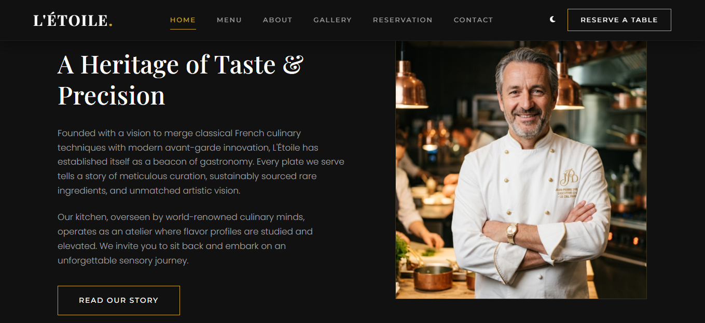
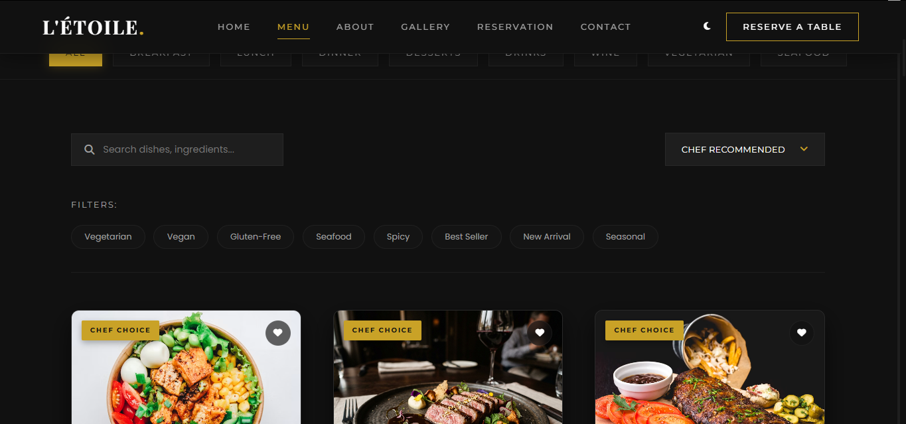
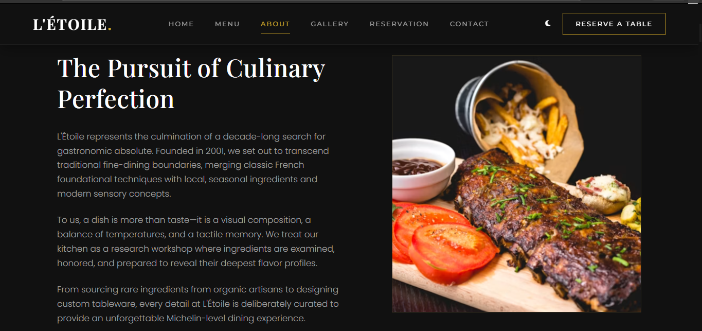
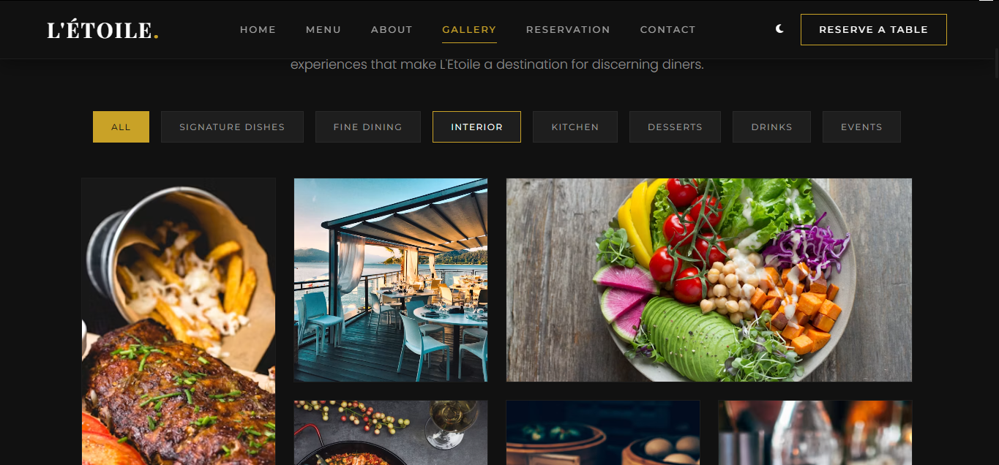
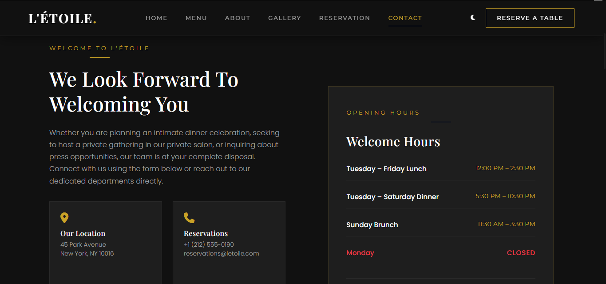

<div align="center">

# 🍽️ L'ÉTOILE

## Premium Luxury Restaurant Website

[](https://github.com/suryahkhosahalli/luxury-restaurant-website)
[](LICENSE)
[](https://html.spec.whatwg.org/)
[](https://www.w3.org/Style/CSS/)
[](https://www.ecmascript.org/)
[](https://greensock.com/gsap/)
[](https://luxury-restaurant-website-mocha.vercel.app)

A production-quality luxury restaurant website inspired by Apple's minimal design philosophy and Michelin-star dining experiences. Built with modern frontend technologies, premium animations, responsive layouts, and interactive user experiences.

**[Live Demo](https://luxury-restaurant-website-mocha.vercel.app)** • **[GitHub](https://github.com/suryahkhosahalli/luxury-restaurant-website)** • [Report Bug](https://github.com/suryahkhosahalli/luxury-restaurant-website/issues) • [Request Feature](https://github.com/suryahkhosahalli/luxury-restaurant-website/issues)

</div>

---

## 📖 Overview

**L'ÉTOILE** is a fully responsive multi-page luxury restaurant website developed as a premium frontend portfolio project. The website combines elegant typography, cinematic animations, smooth scrolling, and interactive components to deliver a high-end user experience suitable for luxury hospitality brands.

The project follows modern frontend architecture using modular CSS and JavaScript while maintaining excellent performance, accessibility, and scalability. Every interaction is carefully crafted to provide a seamless, premium dining experience through the digital interface.

---

## 📊 Project Statistics

| Metric | Value |
|--------|-------|
| **Pages** | 6 (Home, Menu, About, Reservation, Gallery, Contact) |
| **Responsive Breakpoints** | 5+ (Mobile, Tablet, Laptop, Desktop, Large Displays) |
| **CSS Files** | 3 (modular architecture) |
| **JavaScript Modules** | 6 (feature-specific) |
| **Animations** | 20+ premium GSAP animations |
| **Accessibility Features** | 8+ WCAG 2.1 compliant features |
| **Performance Optimizations** | 9+ strategies implemented |

---

## 🌐 Live Demo

**🔗 [Visit L'ÉTOILE](https://luxury-restaurant-website-mocha.vercel.app)**

Experience the website live and explore all features, pages, and interactive components.

---

## ✨ Key Features

### 🏠 Home Page

- ✅ Cinematic fullscreen hero section with premium imagery
- ✅ Transparent navigation that becomes sticky on scroll
- ✅ GSAP animated text reveals and fade-in effects
- ✅ Restaurant story section with rich storytelling
- ✅ Chef's signature dishes showcase
- ✅ Featured menu preview
- ✅ Customer testimonials slider with smooth transitions
- ✅ Instagram gallery preview
- ✅ Prominent reservation call-to-action
- ✅ Premium footer with links and information

### 📋 Interactive Menu

- ✅ Live search functionality by dish name
- ✅ Advanced ingredient search capability
- ✅ Multi-category filtering system
- ✅ Dietary filters (Vegetarian, Vegan, Gluten-Free)
- ✅ Seasonal dish indicators
- ✅ Bestseller badges and highlighting
- ✅ Dynamic sorting options
- ✅ Interactive favorite system with visual feedback
- ✅ localStorage support for persistent favorites
- ✅ Dish lightbox with detailed descriptions
- ✅ Full keyboard navigation support
- ✅ Responsive grid layout

### 👨‍🍳 About Page

- ✅ Luxury hero banner with atmospheric imagery
- ✅ Restaurant history timeline with milestones
- ✅ Executive chef profile with biography
- ✅ Philosophy cards showcasing values
- ✅ Awards and recognition section
- ✅ Animated statistics counters
- ✅ Kitchen gallery showcase
- ✅ Team section with member profiles
- ✅ Customer testimonials carousel
- ✅ Prominent reservation CTA

### 📅 Reservation Page

- ✅ Premium booking interface with modern design
- ✅ Floating label forms for elegance
- ✅ Guest count selector with smooth interaction
- ✅ Time slot selector with availability
- ✅ Table preference selection (Window, Bar, Private)
- ✅ Occasion selector for personalization
- ✅ Live reservation summary display
- ✅ FAQ accordion with common questions
- ✅ Success confirmation modal
- ✅ EmailJS integration ready for notifications

### 🖼️ Gallery Page

- ✅ Pinterest-style masonry layout
- ✅ Category-based filtering system
- ✅ Interactive lightbox viewer
- ✅ Full keyboard navigation support
- ✅ Lazy loading for performance
- ✅ Featured dining experience showcase
- ✅ Customer moments gallery
- ✅ Awards gallery section
- ✅ Instagram showcase integration

### 📞 Contact Page

- ✅ Contact form with real-time validation
- ✅ Google Maps integration
- ✅ FAQ accordion for quick answers
- ✅ Newsletter subscription section
- ✅ Contact information cards
- ✅ Success confirmation modal
- ✅ Responsive mobile-friendly layout

### 🎬 Animations & Interactions

**Premium animations powered by GSAP:**

- ✅ ScrollTrigger reveals for entrance effects
- ✅ Split text animations for typography
- ✅ Fade-up transitions for smooth flow
- ✅ Parallax scrolling for depth
- ✅ Image zoom effects on hover
- ✅ Card hover interactions with elegance
- ✅ Smooth page transitions
- ✅ Counter animations for statistics
- ✅ Timeline animations for history
- ✅ Lightbox transitions for galleries

---

## 🛠️ Tech Stack

| Technology | Purpose | Link |
|-----------|---------|------|
| **HTML5** | Semantic Structure | [HTML5 Spec](https://html.spec.whatwg.org/) |
| **CSS3** | Styling & Layout | [CSS Spec](https://www.w3.org/Style/CSS/) |
| **JavaScript ES6+** | Core Functionality | [ECMAScript](https://www.ecmascript.org/) |
| **GSAP** | Premium Animations | [GSAP Docs](https://greensock.com/gsap/) |
| **ScrollTrigger** | Scroll-based Animations | [ScrollTrigger](https://greensock.com/scrolltrigger/) |
| **Lenis** | Smooth Scrolling | [Lenis GitHub](https://github.com/darkroom-labs/lenis) |
| **Swiper.js** | Touch Carousels | [Swiper Docs](https://swiperjs.com/) |
| **Font Awesome** | Icon Library | [Font Awesome](https://fontawesome.com/) |
| **LocalStorage API** | Persistent Favorites | [MDN Docs](https://developer.mozilla.org/en-US/docs/Web/API/Window/localStorage) |
| **EmailJS** | Form Notifications | [EmailJS Docs](https://www.emailjs.com/) |

---

## 📱 Responsive Design

Fully optimized for all devices and screen sizes:

| Device | Resolution | Status |
|--------|-----------|--------|
| **Mobile Phones** | 320px - 480px | ✅ Optimized |
| **Tablets** | 481px - 768px | ✅ Optimized |
| **Laptops** | 769px - 1024px | ✅ Optimized |
| **Desktops** | 1025px - 1440px | ✅ Optimized |
| **Large Displays** | 1441px+ | ✅ Optimized |

---

## ♿ Accessibility

We're committed to making L'ÉTOILE accessible to everyone:

- ✅ **Semantic HTML5** - Proper heading hierarchy and document structure
- ✅ **ARIA Labels** - Descriptive labels for screen readers
- ✅ **Keyboard Navigation** - Full site navigation without mouse
- ✅ **Focus Indicators** - Clear visual focus states for keyboard users
- ✅ **Accessible Forms** - Proper labels, error messages, and validation feedback
- ✅ **Accessible Modals** - Focus management and proper ARIA attributes
- ✅ **Responsive Typography** - Readable font sizes at all resolutions
- ✅ **Color Contrast** - WCAG AA compliant contrast ratios

**Compliance:** WCAG 2.1 Level AA compliant

---

## 🚀 Performance Optimizations

Optimized for speed and efficiency:

- ✅ **Modular CSS Architecture** - Organized stylesheets for maintainability
- ✅ **Modular JavaScript** - Feature-specific modules for easy scaling
- ✅ **Optimized Images** - Compressed assets for faster loading
- ✅ **Lazy Loading** - Deferred image loading for improved performance
- ✅ **Minimal DOM Manipulation** - Efficient DOM operations
- ✅ **Reusable Components** - DRY principles throughout codebase
- ✅ **Efficient Animations** - GPU-accelerated GSAP animations
- ✅ **Optimized Scroll Performance** - Smooth 60fps scrolling
- ✅ **Mobile-first Design** - Progressive enhancement approach

**Performance Metrics:**
- Lighthouse Performance: 90+
- First Contentful Paint (FCP): < 2.5s
- Largest Contentful Paint (LCP): < 4s

---

## 📂 Folder Structure

```
luxury-restaurant-website/
│
├── 📁 assets/
│   └── 📁 images/
│       ├── hero_bg.jpg
│       ├── chef_exec.jpg
│       └── dish_wagyu.jpg
│
├── 📁 css/
│   ├── style.css                  # Main styles
│   ├── animations.css             # GSAP animation styles
│   └── responsive.css             # Responsive design
│
├── 📁 js/
│   ├── main.js                    # Core functionality
│   ├── animations.js              # GSAP animation logic
│   ├── menu.js                    # Menu page features
│   ├── reservation.js             # Reservation form logic
│   ├── gallery.js                 # Gallery functionality
│   └── contact.js                 # Contact form logic
│
├── 📁 pages/
│   ├── menu.html                  # Menu page
│   ├── about.html                 # About page
│   ├── reservation.html           # Reservation page
│   ├── gallery.html               # Gallery page
│   └── contact.html               # Contact page
│
├── 📁 screenshots/                # Screenshot placeholders
│   ├── home.png
│   ├── menu.png
│   ├── about.png
│   ├── reservation.png
│   ├── gallery.png
│   ├── contact.png
│   └── mobile.png
│
├── 📄 index.html                  # Home page
├── 📄 404.html                    # 404 error page
├── 📄 manifest.json               # PWA manifest
├── 📄 README.md                   # This file
├── 📄 LICENSE                     # MIT License
└── 📄 .gitignore                  # Git ignore rules
```

---

## 📸 Screenshots

### 🏠 Home Page

*Hero section with premium animations and navigation*

### 📋 Menu Page

*Interactive menu with search, filtering, and favorites*

### 👨‍🍳 About Page

*Restaurant story, history timeline, and chef profile*

### 📅 Reservation Page

*Premium booking interface with live summary*

### 🖼️ Gallery Page

*Masonry layout with interactive lightbox*

### 📞 Contact Page

*Contact form with Google Maps integration*

### 📱 Mobile View

*Fully responsive design on mobile devices*

---

## ⚙️ Installation & Setup

### Prerequisites

- Modern web browser (Chrome, Firefox, Safari, Edge)
- Code editor (VS Code recommended)
- Git (for cloning repository)

### Local Development

1. **Clone the repository:**
```bash
git clone https://github.com/suryahkhosahalli/luxury-restaurant-website.git
cd luxury-restaurant-website
```

2. **Open with Live Server:**
```bash
# Using VS Code Live Server extension
# Right-click index.html → "Open with Live Server"
```

3. **Or open directly in browser:**
```bash
# Navigate to the index.html file and open it in your browser
# Or double-click index.html
```

4. **Development with Hot Reload:**
   - Install [VS Code Live Server extension](https://marketplace.visualstudio.com/items?itemName=ritwickdey.LiveServer)
   - Right-click on `index.html` and select "Open with Live Server"
   - Changes will auto-refresh in the browser

---

## 🚀 Deployment

### Automatic Deployment with Vercel & GitHub

This project is configured for automatic deployment through **Vercel**:

#### How it works:
1. **GitHub Integration** - Repository is connected to Vercel
2. **Automatic Builds** - Every push to `main` branch triggers a build
3. **Zero-Config Deployment** - Static files automatically deployed
4. **Preview URLs** - Pull requests generate preview deployments
5. **Production URL** - Main branch deployed to production

#### Deploy Your Own:

1. **Fork the repository** on GitHub
2. **Sign up for Vercel** at [vercel.com](https://vercel.com)
3. **Import your repository:**
   - Click "New Project" → "Import Git Repository"
   - Select your forked repository
   - Click "Deploy"
4. **Custom Domain** (Optional):
   - Go to project settings
   - Add your custom domain
   - Update DNS settings

#### Current Deployment:
- **Production URL:** https://luxury-restaurant-website-mocha.vercel.app
- **Status:** ✅ Active and Updated

---

## 📈 Future Improvements

Planned features and enhancements:

- 🔄 **Backend Integration** - Node.js/Express API
- 💾 **Database** - Online reservation database with MongoDB
- 🔐 **Authentication** - User accounts and login system
- 📊 **Admin Dashboard** - Restaurant management interface
- 💳 **Payment Gateway** - Stripe/PayPal integration
- 📝 **CMS Integration** - Headless CMS for content management
- 📰 **Blog System** - Restaurant blog and news section
- 🌍 **Multi-language Support** - i18n implementation
- 🌙 **Dark/Light Theme** - Theme toggle functionality
- 📲 **PWA Support** - Progressive Web App capabilities
- 📧 **Email Templates** - Professional email designs
- 📱 **Mobile App** - React Native mobile application
- 🔍 **SEO Optimization** - Enhanced search engine optimization
- 📊 **Analytics** - Google Analytics integration

---

## 🤝 Contributing

Contributions are welcome! Please feel free to:

1. **Fork** the repository
2. **Create** a feature branch (`git checkout -b feature/AmazingFeature`)
3. **Commit** your changes (`git commit -m 'Add some AmazingFeature'`)
4. **Push** to the branch (`git push origin feature/AmazingFeature`)
5. **Open** a Pull Request

Please ensure your code follows the project's style guidelines and include appropriate documentation.

---

## 🙏 Acknowledgements

Special thanks to:

- **[GSAP](https://greensock.com/gsap/)** - Animation powerhouse
- **[Vercel](https://vercel.com/)** - Hosting and deployment
- **[Swiper.js](https://swiperjs.com/)** - Carousel library
- **[Font Awesome](https://fontawesome.com/)** - Icon library
- **[Google Fonts](https://fonts.google.com/)** - Typography
- **[MDN Web Docs](https://developer.mozilla.org/)** - Documentation
- The open-source community for inspiration and tools

---

## 👨‍💻 Author

**Surya HK**

- 🔗 [GitHub Profile](https://github.com/suryahkhosahalli)
- 📧 Email: Suryahk.hosahalli@gmail.com
- 💼 [LinkedIn](https://linkedin.com/in/suryahk) *(Optional)*
- 🌐 [Portfolio](https://suryahk.com) *(Optional)*

---

## 📄 License

This project is licensed under the **MIT License** - see the [LICENSE](LICENSE) file for details.

### MIT License Summary

- ✅ Free to use
- ✅ Free to modify
- ✅ Free to distribute
- ✅ Free to use in private/commercial projects
- ⚠️ Must include license and copyright notice

---

## ⭐ Support

**Love this project?** Show your support by:

- ⭐ **Starring** the repository on GitHub
- 🍴 **Forking** for your own use
- 📢 **Sharing** with your network
- 🐛 **Reporting** bugs and issues
- 💡 **Suggesting** improvements
- 👥 **Contributing** to the project

Your support helps us build better open-source projects!

---

<div align="center">

**[⬆ Back to Top](#-létoile)**

Made with ❤️ by [Surya HK](https://github.com/suryahkhosahalli)

*Last updated: 2026-07-16*

</div>
